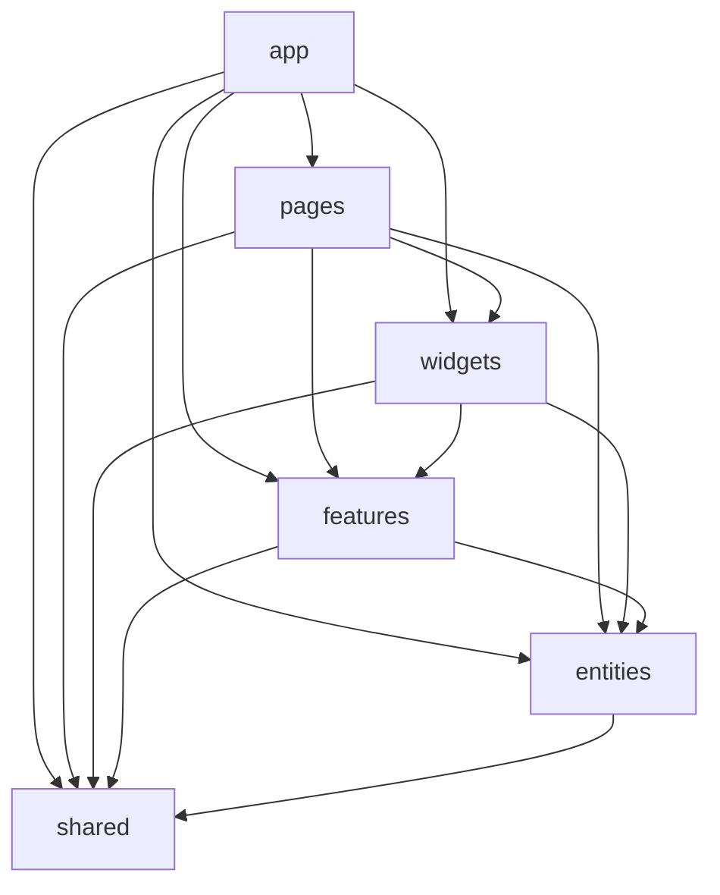

## Архітектура проєкту (Feature-Sliced Design)

Діаграма напрямку залежностей між шарами застосунку (верхні шари імпортують лише нижні):

```mermaid
graph TD
  App[app] --> Pages[pages]
  App --> Widgets[widgets]
  App --> Features[features]
  App --> Entities[entities]
  App --> Shared[shared]

  Pages --> Widgets
  Pages --> Features
  Pages --> Entities
  Pages --> Shared

  Widgets --> Features
  Widgets --> Entities
  Widgets --> Shared

  Features --> Entities
  Features --> Shared

  Entities --> Shared
```